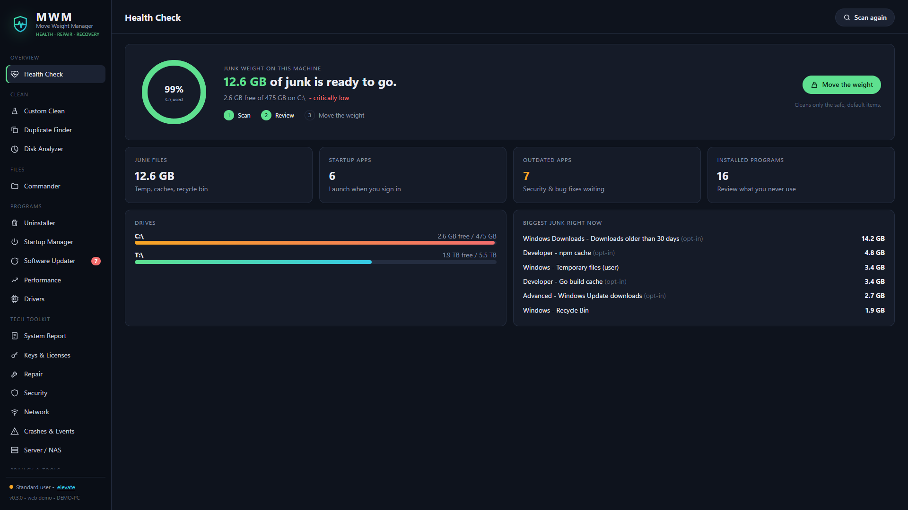

<p align="center"></p>
<h1 align="center">MWM - Move Weight Manager</h1>
<p align="center"><b>PC health, repair and recovery - for your PC and your servers.</b><br>
Free and open source. No ads, no "Pro" tier, no telemetry.</p>

<p align="center"><a href="https://manage.moveweight.com/">Website</a> · <a href="https://manage.moveweight.com/app/">Private web manager</a></p>

<p align="center"></p>

MWM replaces the pile of tools a PC tech carries - **cleaner, uninstaller, dual-pane file manager and the
Geek Squad / Hiren's repair kit** - with one ~4 MB app for Windows, and a single static binary that gives
**Proxmox VE, Unraid and any Linux server** the same power in a browser.

## What it does

| Area | MWM |
|---|---|
| **Health Check** | Junk, startup, outdated apps and disk at a glance; one click cleans only the safe defaults |
| **Custom Clean** | 40+ rules: Windows temp, recycle bin, thumbnails, crash dumps, WER, Update cache, Store apps, NVIDIA/Discord/VS Code/Steam caches, dev caches, every Chromium browser + Firefox (cache, history, cookies). Linux: apt/dnf cache, journals, rotated logs, /tmp, Proxmox task logs |
| **Uninstaller** | Runs the real uninstaller (UAC-aware), then hunts leftover folders, shortcuts and registry keys. Leftovers go to the Recycle Bin; registry keys are backed up as `.reg` first. Store apps, dpkg/flatpak/snap on Linux |
| **Startup Manager** | Startup apps, scheduled tasks, third-party services / systemd units - toggled the Task Manager way, never deleted |
| **Software Updater** | Free, via winget / apt / brew - updates straight from the publisher |
| **Commander** | Dual-pane, keyboard-first file manager (Double Commander / Geek Squad FMOD style): F3 view (text/image/hex), F5 copy, F6 move, F7 mkdir, F8 recycle, search by name/content, compare panes, multi-rename, zip pack/unpack, folder sizes, network drives. Copies run as background jobs with progress, cancel and conflict handling |
| **Keys & Licenses** | Windows key from firmware (OEM) and decoded from the registry, every license's status, Office 2010/2013 keys, **BitLocker recovery keys**, saved Wi-Fi passwords; SSH host keys, Proxmox subscription, Unraid license, WireGuard on Linux. Show / copy / export |
| **Repair** | SFC, DISM RestoreHealth + component cleanup, chkdsk, Windows Update reset, restore point, clock resync, icon cache, DNS flush, IP renew, network stack reset, print spooler, Defender update / quick / full scan, battery + energy reports, memory test. Linux: fix broken packages, remove old kernels, Docker cleanup, ZFS scrub, SMART self-tests, journal vacuum. Live output, keeps running across pages |
| **System Report** | Maker/model/serial, BIOS, board, CPU, RAM sticks, GPUs, activation, disk health (temp, wear, hours, errors), battery - exportable HTML report for a customer or a ticket |
| **Security** | Defender, firewall, UAC, BitLocker, threat history |
| **Network** | Router → internet → DNS → HTTPS test with a plain-English verdict and one-click fixes |
| **Crashes & Events** | Blue screens, hard resets, minidumps and a searchable error log |
| **Server / NAS** | Proxmox cluster guests (start / shut down / reboot on any node), storage, ZFS pools + scrub, SMART for every disk, Docker containers, Unraid array, failed services, kernels |
| **Service plugins** | Discover Sonarr, Radarr, Lidarr, Prowlarr, RomMarr, Maintainerr and CleanUpArr on the owning Proxmox node. Optional local MCP-ARR bridge exposes the upstream MCP tools in the same desktop/web UI |
| Also | Duplicate Finder (BLAKE3), Disk Analyzer, Performance (heavy processes), Drivers (inventory - updates only via Windows Update, never third-party mirrors), Shredder + free-space wipe, System Tools launcher |

## Install

### Windows 10 / 11
Windows desktop packaging is in progress. Use only a release that has passed the Windows Defender gate; the current preview was blocked during validation and is not ready for distribution.

### Proxmox VE / Debian / Ubuntu
```sh
curl -fsSL https://github.com/BlizzHacker/mwm/releases/latest/download/install.sh | sh -s -- --web
```
Then open `http://<server>:7777/?token=...` (the installer prints it). `--read-only` gives a look-don't-touch
dashboard. Prefer packages? `apt install ./mwm_x.y.z_amd64.deb` then `systemctl enable --now mwm-web`.

### Unraid
*Plugins → Install Plugin* → `https://github.com/BlizzHacker/mwm/releases/latest/download/mwm.plg`
The web UI starts on port 7777; the plugin prints the sign-in link.

### Command line (every platform)
```
mwm info                 machine, disks, elevation
mwm scan                 measure every cleaning rule (deletes nothing)
mwm clean [--ids a,b] --yes
mwm apps [filter]        installed programs      mwm uninstall <id> --yes
mwm startup [--set ID off]                       mwm updates [--apply all]
mwm keys                 keys & licenses         mwm report    hardware / license report
mwm server               Proxmox / ZFS / SMART / Docker
mwm repair --list        repair tasks            mwm repair sfc
mwm dupes <dir>          mwm analyze <dir>       mwm shred <file> --yes
mwm serve [--bind 0.0.0.0:7777] [--read-only]    browser UI
mwm --json <command>     machine-readable output
```

## Safety model
- Scans never delete. Cleaning only touches caches/temp and skips files in use.
- Uninstall leftovers → Recycle Bin; registry keys exported to `.reg` before removal. Leftover matching refuses
  generic names, anything containing a program root or your profile, and anything another program still uses.
- Startup toggles are Task Manager-compatible and reversible. Repairs use only tools the OS ships.
- `mwm serve` requires a random access token (HttpOnly, SameSite=Strict cookie; JSON-only API, so no CSRF);
  `--read-only` refuses every change. It is plain HTTP - keep it on your LAN or behind a reverse proxy / VPN.
- Local credentials are not sent to the public MWM site. When you connect one MWM agent to another, results you request can traverse that authenticated connection; protect agent tokens and use a trusted network.

## MCP-ARR compatibility

MWM has its own Proxmox service discovery and can also connect to [MCP-ARR](https://github.com/aplaceforallmystuff/mcp-arr). On a Proxmox node that owns Sonarr/Radarr/Lidarr/Prowlarr, run `sudo python3 deploy/arr/install.py` from an MWM checkout to install MCP-ARR on `127.0.0.1:3000/mcp`. The installer reads each running service's API key from its LXC, writes a root-only `/etc/mwm/mcp-arr.env`, and starts the upstream container. Docker administrators can inspect container environment and should be trusted with these keys.

In MWM, choose that node in the machine switcher, open **Plugins**, click **Connect MCP-ARR**, then **Browse tools**. On a Windows PC, the same page can connect to an MCP-ARR instance running locally even without Proxmox. The bridge accepts loopback endpoints only, because MCP-ARR HTTP mode has no documented access control. MWM's native service status view remains usable without MCP-ARR.

## Build (everything cross-compiles from Linux)
```
rustup target add x86_64-pc-windows-msvc x86_64-unknown-linux-musl
cargo install cargo-xwin tauri-cli
cd app/src-tauri && cargo tauri build --runner cargo-xwin --target x86_64-pc-windows-msvc
cargo build --release --target x86_64-unknown-linux-musl -p mwm-cli
packaging/linux/build-packages.sh 0.3.0 dist/            # .deb, Unraid .plg, install.sh, SHA256SUMS
```
Store package (on Windows with the Windows SDK): `packaging/msix/build-msix.ps1`.
Layout: `crates/mwm-core` (engine + one command table `api.rs`), `crates/mwm-cli` (`mwm`, incl. `serve`),
`app/src-tauri` (desktop shell), `app/ui` (plain HTML/JS UI shared by desktop, web and demo).

## Roadmap
1. **Windows** - desktop app, installer, MSIX for the Microsoft Store. *Shipping.*
2. **Linux / Proxmox / Unraid** - static CLI + browser UI + server dashboard. *Shipping.* Next: AppImage desktop
   build, TrueNAS SCALE app, multi-server view.
3. **MWM Rescue** - bootable USB (SystemRescue-based) with MWM, offline Windows repair (SFC /offbootdir,
   DISM /image), file recovery and malware scanning for PCs that won't boot.
4. **Android** - storage insight, large/duplicate files, app cache cleanup within Android's rules.
5. **iOS / iPadOS** - photo/file duplicate cleanup and storage insight (Apple allows nothing more).
6. **macOS** - engine rules exist; needs a signed/notarized build.

## License
GPL-3.0-or-later. © 2026 MoveWeight Foundation. See [LICENSE](LICENSE) and [PRIVACY.md](PRIVACY.md).
